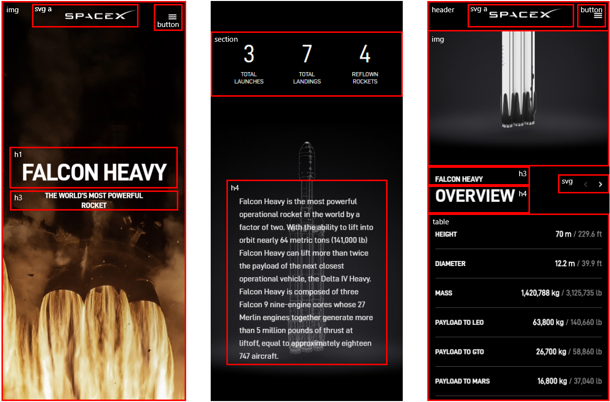
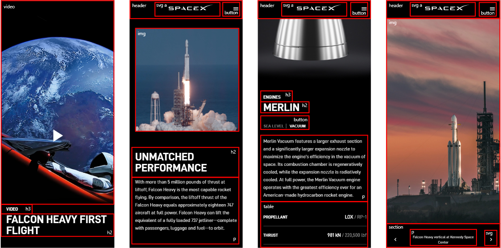
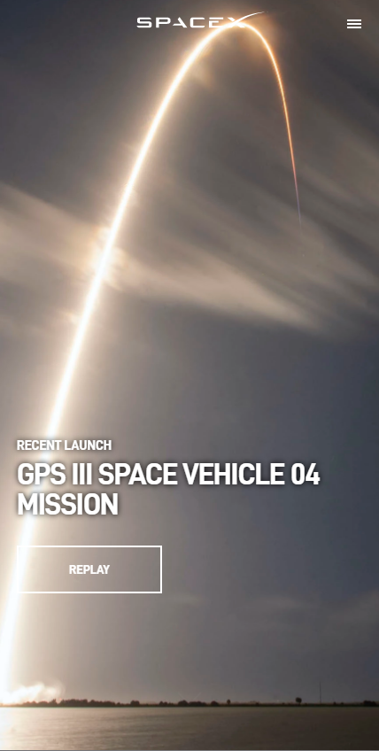
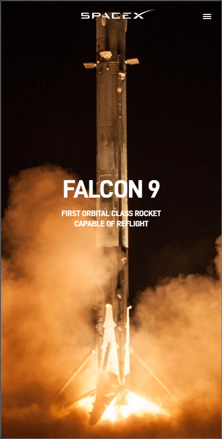

# Procesverslag
**Auteur:** Giovanni Kornet

Markdown cheat cheet: [Hulp bij het schrijven van Markdown](https://github.com/adam-p/markdown-here/wiki/Markdown-Cheatsheet). Nb. de standaardstructuur en de spartaanse opmaak zijn helemaal prima. Het gaat om de inhoud van je procesverslag. Besteedt de tijd voor pracht en praal aan je website.

## Bronnenlijst
1. https://meyerweb.com/eric/articles/webrev/200007a.html
2. -bron 2-
3. -...-

## Eindgesprek (week 7/8)

-dit ging goed & dit was lastig-

**Screenshot(s):**

-screenshot(s) van je eindresultaat-

## Voortgang 3 (week 6)

-dit ging goed & dit was lastig-

Feedback:
- aanpassen gebruik van divs en classes/id's naar pseudo-classes waar mogelijk
- Javascript best practices - var, let, const in combinatie met arrow function etc.
- max-width van mediaquery aanpassen naar min-width (mobile-first)
- meer doen met animaties
- hamburger menu werkend maken
- font-awesome hamburger icon vervangen
- microinteractie met SVG. Op mobiel evt. werken met transforms en gestures (pinch, spread etc). Gebruiker SVG laten manipuleren.

**Screenshot(s):**

-screenshot(s) van hoe ver je bent met korte uitleg-

## Voortgang 2 (week 5)

-dit ging goed & dit was lastig-

Feedback:
- minder divs en classes/id's waar mogelijk
- gekkere animaties toevoegen, beetje out of the box qua animaties

**Screenshot(s):**

-screenshot(s) van hoe ver je bent met korte uitleg-

## Voortgang 1 (week 3)

### Stand van zaken

-dit ging goed & dit was lastig-

Feedback:
- picture html element i.p.v. img
- bekijken sourceset voor background-images
- i.p.v. form een definition list
- minder divs en classes/id's waar mogelijk. Code verkleinen en flexbox gebruiken op tekst positionering ipv hard-coded positioneringen.

**Screenshot(s):**

-screenshot(s) van hoe ver je bent met korte uitleg-

### Agenda voor meeting

-samen met je groepje opstellen-

| student 1      | student 2          | student 3    | student 4        |
| ---            | ---                | ---          | ---              |
| dit bespreken  | en dit             | en ik dit    | en dan ik dat    |
| an dat ook nog | dit als er tijd is | nog een punt | dit wil ik zeker |
| ...            | ...                | ...          | ...              |

### Verslag van meeting

-na afloop snel uitkomsten vastleggen-

## Breakdownschets (week 1)

## Intake (week 1)
-uitwerken voor de kick-off werkgroep - begin van de eerste week-

**Je startniveau:** Zwarte piste

**Je focus:** Responsive

**Je opdracht:** https://www.spacex.com/

**Screenshot(s) van de eerste pagina (small screen):**

**Screenshot(s) van de tweede pagina (small screen):**

